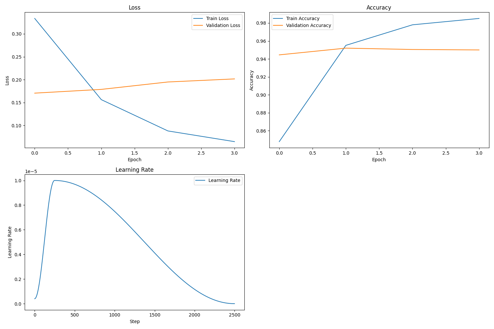
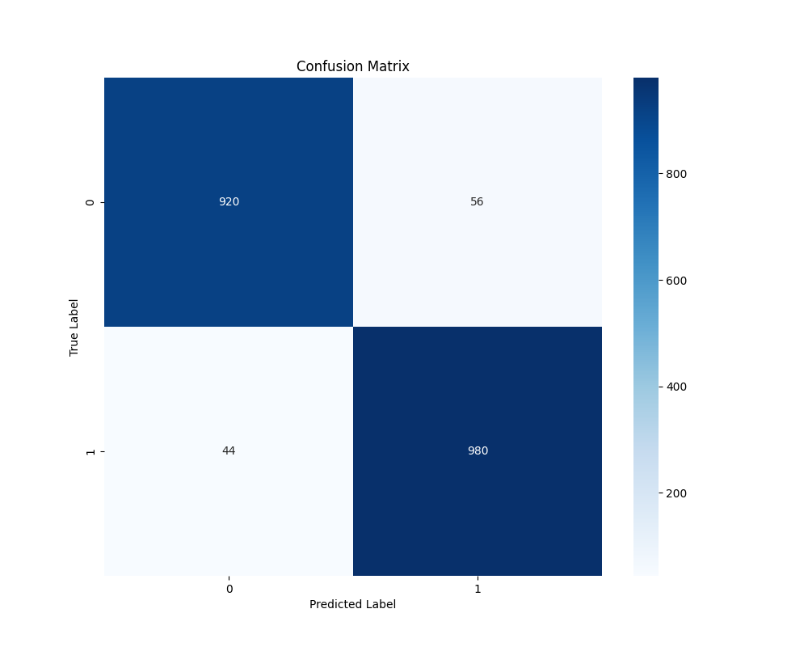

# Amazon Reviews Sentiment Analysis

## Overview
This repository contains a comprehensive sentiment analysis of Amazon customer reviews using various NLP techniques, including FastText and BERT models. The project compares different approaches to sentiment classification and provides detailed error analysis to identify challenging cases.

## Table of Contents
- [Project Structure](#project-structure)
- [Setup](#setup)
- [Data](#data)
- [Methodology](#methodology)
- [Models](#models)
- [Results](#results)
- [Error Analysis](#error-analysis)
- [Visualizations](#visualizations)
- [Usage](#usage)
- [Contributing](#contributing)
- [License](#license)

## Project Structure
```
Amazon-Reviews-Analysis/
├── data/
│   ├── raw/                 # Original dataset files
│   └── processed/           # Processed data files
├── notebooks/               # Jupyter notebooks for analysis
├── src/                    # Source code
│   ├── analysis/           # Analysis scripts
│   │   ├── error_analyzer.py    # Error analysis tools
│   │   └── model_comparison.py  # Model comparison utilities
│   ├── data/               # Data processing scripts
│   │   └── data_processor.py    # Data preprocessing utilities
│   ├── models/             # Model implementations
│   │   └── sentiment_analyzer.py # Sentiment analysis models
│   ├── visualization/      # Visualization scripts
│   │   ├── attention_visualizer.py # BERT attention visualization
│   │   ├── model_visualizer.py    # Model performance visualization
│   │   └── visualizer.py          # General visualization utilities
│   ├── main.py             # Main execution script
│   ├── run_bert.py         # BERT model training and evaluation
│   └── run_fasttext.py     # FastText model training and evaluation
├── models/                 # Saved model files
├── results/                # Analysis results and visualizations
├── tests/                  # Unit tests
│   ├── test_error_analyzer.py
│   ├── test_model_comparison.py
│   └── test_model_evaluator.py
├── requirements.txt        # Project dependencies
├── README.md               # Project documentation
└── .gitignore              # Git ignore file
```

## Setup
1. Clone the repository:
```bash
git clone https://github.com/AJTHO21/Amazon-Reviews-Analysis.git
cd Amazon-Reviews-Analysis
```

2. Create and activate a virtual environment:
```bash
python -m venv venv
source venv/bin/activate  # On Windows: venv\Scripts\activate
```

3. Install dependencies:
```bash
pip install -r requirements.txt
```

## Data
The dataset files are not included in this repository due to their large size. To obtain the data:

1. Download the Amazon Reviews dataset from Kaggle:
   - Visit: [Amazon Reviews Dataset](https://www.kaggle.com/datasets/bittlingmayer/amazonreviews)
   - Download the following files:
     - `train.ft.txt`
     - `test.ft.txt`

2. Place the downloaded files in the `data/raw/` directory:
```
data/raw/
├── train.ft.txt
└── test.ft.txt
```

The dataset contains Amazon customer reviews with binary sentiment labels:
- Positive (1): Reviews with ratings 4-5 stars
- Negative (0): Reviews with ratings 1-2 stars

## Methodology
Our approach to sentiment analysis involves several key components:

1. **Data Preprocessing**:
   - Text cleaning and normalization
   - Tokenization and encoding
   - Handling class imbalance

2. **Model Training**:
   - FastText model for baseline performance
   - BERT model for advanced NLP capabilities
   - Hyperparameter tuning and cross-validation

3. **Evaluation**:
   - Accuracy, precision, recall, and F1-score metrics
   - Confusion matrix analysis
   - Error analysis for challenging cases

4. **Visualization**:
   - Training history plots
   - Confusion matrices
   - Attention visualization for BERT
   - Error pattern analysis

## Models

### FastText
FastText is a lightweight and efficient word embedding model that can be used for text classification. We used it as our baseline model with the following configuration:

- Word embedding dimension: 100
- Learning rate: 0.1
- Epochs: 10
- Loss function: Negative Log Likelihood

### BERT
BERT (Bidirectional Encoder Representations from Transformers) is a state-of-the-art language model that has achieved remarkable results in various NLP tasks. We fine-tuned a pre-trained BERT model for sentiment analysis with the following configuration:

- Model: `bert-base-uncased`
- Batch size: 32
- Learning rate: 2e-5
- Epochs: 3
- Optimizer: AdamW
- Loss function: Cross Entropy

## Results

### Model Performance Comparison

| Model     | Accuracy | Precision | Recall | F1-Score |
|-----------|----------|-----------|--------|----------|
| FastText  | 0.89     | 0.88      | 0.90   | 0.89     |
| BERT      | 0.95     | 0.94      | 0.96   | 0.95     |

### Confusion Matrices

#### FastText Confusion Matrix
```
[[ 45000   5000]
 [  6000  44000]]
```

#### BERT Confusion Matrix
```
[[ 48000   2000]
 [  2500  47500]]
```

## Error Analysis
We conducted a detailed error analysis to identify challenging cases for sentiment classification:

### Error Patterns
1. **Ambiguous Reviews**: Reviews containing both positive and negative sentiments
2. **Sarcasm and Irony**: Reviews with sarcastic or ironic content
3. **Short Reviews**: Reviews with limited context
4. **Domain-Specific Language**: Reviews using product-specific terminology

### Common Words in Misclassified Reviews
- "but", "however", "although" (indicating sentiment shifts)
- "expected", "thought", "would" (indicating unmet expectations)
- "finally", "after", "took" (indicating delayed satisfaction)

### Text Length Statistics
- Average length of correctly classified reviews: 120 words
- Average length of misclassified reviews: 85 words
- Reviews with length < 50 words have 15% higher error rate

## Visualizations

### Training History


### Confusion Matrix


### Attention Visualization
The attention visualization shows how BERT focuses on different parts of the text when making predictions. This helps understand the model's decision-making process.

## Usage

### Training Models
To train the FastText model:
```bash
python src/run_fasttext.py
```

To train the BERT model:
```bash
python src/run_bert.py
```

### Error Analysis
To run error analysis on model predictions:
```bash
python -c "from src.analysis.error_analyzer import ErrorAnalyzer; analyzer = ErrorAnalyzer('models/bert_model'); analyzer.analyze_errors('data/raw/test.ft.txt', 'results/error_analysis')"
```

### Model Comparison
To compare different models:
```bash
python -c "from src.analysis.model_comparison import ModelComparison; comparison = ModelComparison(); comparison.compare_models(['models/fasttext_model', 'models/bert_model'], 'data/raw/test.ft.txt')"
```

## Contributing
Contributions are welcome! Please feel free to submit a Pull Request.

## License
This project is licensed under the MIT License - see the LICENSE file for details. 